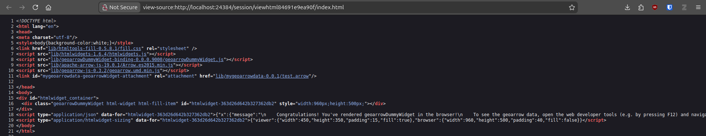

```{r setup, include = FALSE}
knitr::opts_chunk$set(
  collapse = TRUE,
  eval = FALSE,
  comment = "#>",
  out.width = "100%"
)
```

## geoarrowWidget

The aim of `geoarrowWidget` is to facilitate fast transfer of geospatial data 
between R memory and the browser using `geoarrow` memory layout. 
It provides functionality to attach `geoarrow` data to existing `htmlwidgets` along
with the relevant JavaScript libraries to handle this data in the browser context.

For testing purposes, `geoarrowWidget` provides a minimal `htmlwidget` called 
`geoarrowDummyWidget`. Here's an example of how to use it:

```r
library(geoarrowWidget)
library(wk)
library(nanoarrow)
library(geoarrow)

### generate some random sf points data ========================================
n = 1e5
dat = data.frame(
  id = 1:n
  , geometry = xy(
    x = runif(n, -160, 160)
    , y = runif(n, -40, 40)
    , crs = 4326
  )
)

### setup and write to tempfile as geoarrow ====================================
fl = tempfile()
dir.create(fl)
path = file.path(
  fl
  , "test.arrow"
)

interleaved = FALSE

data_stream = nanoarrow::as_nanoarrow_array_stream(
  dat
  , geometry_schema = geoarrow::infer_geoarrow_schema(
    dat
    , coord_type = ifelse(interleaved, "INTERLEAVED", "SEPARATE")
  )
)

nanoarrow::write_nanoarrow(data_stream, path)

### create widget and check browser console ====================================
wgt = geoarrowDummyWidget(file = path)

options(viewer = NULL)

wgt
```

This will create a web page with the data attached as a geoarrow object. 
In the browser console (press F12) this will look something like this 
(depending on the browser obviously, Librewolf in this case)


The page source (press <CTRL + u>) will look something like this, where in 
line 11 you see the attached test.arrow file and above the necessary scripts 
(arrow and geoarrow JS bindings) to process the data further in JavaScript.



### Acknowledgment

This project has been realized with financial [support](https://r-consortium.org/all-projects/funded-projects.html) from the

<a href="https://r-consortium.org/all-projects/funded-projects.html">

</a>
